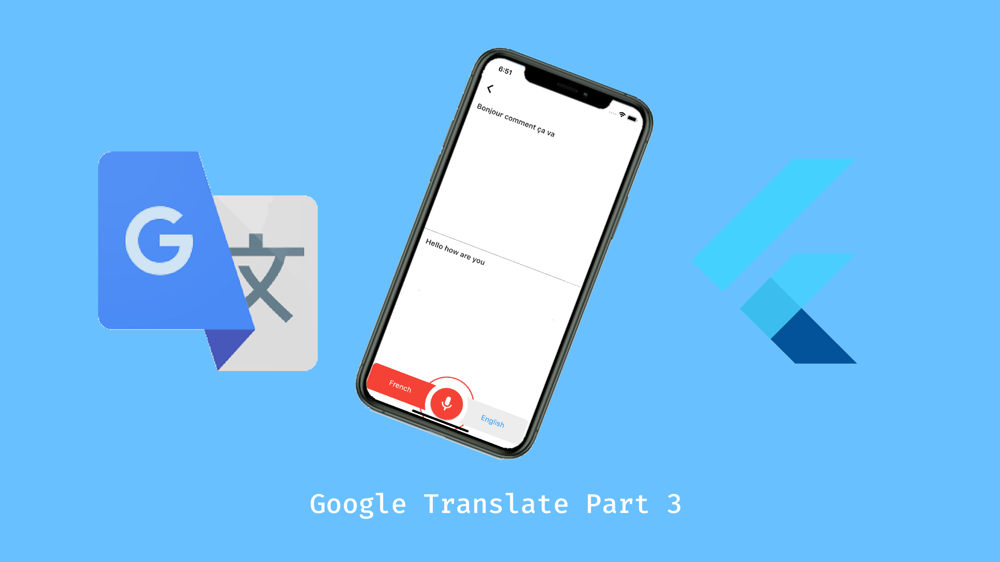

<h1 align=center>Google Translate part 3</h1>
 
    

## 📋 Article
* <a href='https://medium.com/@applichic/flutter-google-translate-part-3-e5f3cd498ef3'>Medium</a>
    
Previous article:
* <a href='https://applichic.fr/#/articles/101baae8-6c0c-4d61-97c7-aa0ce3623f36'>Applichic</a>

## 🐝 Current features
- [x] Home page design
- [x] Language selection
- [x] Translating text
- [x] Voice recognition
- [x] Conversation page

## 🚧 Future features
- [ ] Handwriting page
- [ ] Translating text from an image
- [ ] Favorite translations
- [ ] Store the last translations
